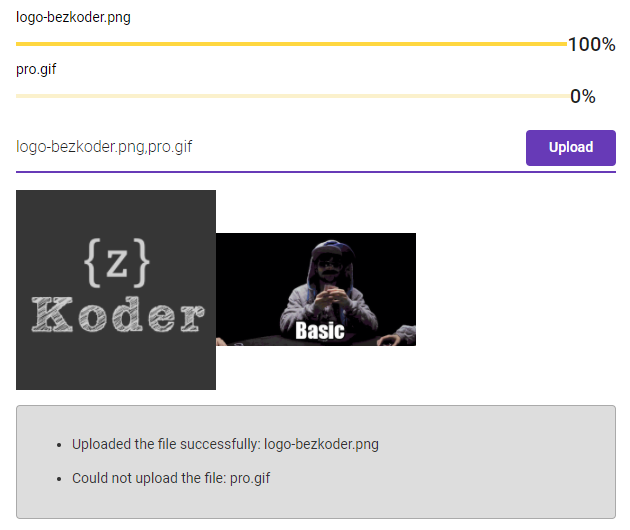

# Angular Material 14 Image upload with Preview example

In this tutorial, I will show you way to build Multiple Images upload with Preview example using Angular Material 14 and FormData with Progress Bars.

Show upload status for each file:

For more detail, please visit:
> [Angular Material 14 Image upload with Preview example](https://www.bezkoder.com/angular-material-14-image-upload-preview/)

Rest APIs server for this Angular Client:
> [Node.js Express File Upload Rest API example](https://www.bezkoder.com/node-js-express-file-upload/)

> [Node.js Express File Upload with Google Cloud Storage example](https://www.bezkoder.com/google-cloud-storage-nodejs-upload-file/)

> [Spring Boot Multipart File upload (to static folder) example](https://www.bezkoder.com/spring-boot-file-upload/)

> [Spring Boot Multipart File upload (to database) example](https://www.bezkoder.com/spring-boot-upload-file-database/)

More practice:
> [Angular 14 & Bootstrap: Multiple Images upload with Preview](https://www.bezkoder.com/angular-14-multiple-image-upload-preview/)

> [Angular 14 CRUD example with Rest API](https://www.bezkoder.com/angular-14-crud-example/)

> [Angular 14 Pagination example | ngx-pagination](https://www.bezkoder.com/angular-14-pagination-ngx/)

> [Angular 14 JWT Authentication & Authorization with Web API](https://www.bezkoder.com/angular-14-jwt-auth/)

Fullstack with Node:

> [Angular 14 + Node Express + MySQL example](https://www.bezkoder.com/angular-14-node-js-express-mysql/)

> [Angular 14 + Node Express + PostgreSQL example](https://www.bezkoder.com/angular-14-node-js-express-postgresql/)

> [Angular 14 + Node Express + MongoDB example](https://www.bezkoder.com/mean-stack-crud-example-angular-14/)

> [Angular 14 + Node Express: File upload example](https://www.bezkoder.com/angular-14-node-express-file-upload/)

> [Angular 14 + Node.js Express: JWT Authentication and Authorization example](https://www.bezkoder.com/node-js-angular-14-jwt-auth/)

Fullstack with Spring Boot:

> [Angular 14 + Spring Boot + H2 Embedded Database example](https://www.bezkoder.com/spring-boot-angular-14-crud/)

> [Angular 14 + Spring Boot + MySQL example](https://www.bezkoder.com/spring-boot-angular-14-mysql/)

> [Angular 14 + Spring Boot + PostgreSQL example](https://www.bezkoder.com/spring-boot-angular-14-postgresql/)

> [Angular 14 + Spring Boot + MongoDB example](https://www.bezkoder.com/spring-boot-angular-14-mongodb/)

> [Angular 14 + Spring Boot: File upload example](https://www.bezkoder.com/angular-14-spring-boot-file-upload/)

> [Angular 14 + Spring Boot: JWT Authentication and Authorization example](https://www.bezkoder.com/angular-14-spring-boot-jwt-auth/)

Fullstack with Django:
> [Angular + Django example](https://www.bezkoder.com/django-angular-13-crud-rest-framework/)

> [Angular + Django + MySQL](https://www.bezkoder.com/django-angular-mysql/)

> [Angular + Django + PostgreSQL](https://www.bezkoder.com/django-angular-postgresql/)

> [Angular + Django + MongoDB](https://www.bezkoder.com/django-angular-mongodb/)

Serverless with Firebase:
> [Angular 14 Firebase CRUD with Realtime DataBase](https://www.bezkoder.com/angular-14-firebase-crud/)

> [Angular 14 Firestore CRUD example](https://www.bezkoder.com/angular-14-firestore-crud/)

> [Angular 14 Firebase Storage: File Upload/Display/Delete example](https://www.bezkoder.com/angular-14-firebase-storage/)

Integration (run back-end & front-end on same server/port)
> [How to integrate Angular with Node.js Restful Services](https://www.bezkoder.com/integrate-angular-12-node-js/)

> [How to Integrate Angular with Spring Boot Rest API](https://www.bezkoder.com/integrate-angular-12-spring-boot/)

## Development server

Run `ng serve --port 8081` for a dev server. Navigate to `http://localhost:8081/`. The app will automatically reload if you change any of the source files.

## Code scaffolding

Run `ng generate component component-name` to generate a new component. You can also use `ng generate directive|pipe|service|class|guard|interface|enum|module`.

## Build

Run `ng build` to build the project. The build artifacts will be stored in the `dist/` directory.

## Running unit tests

Run `ng test` to execute the unit tests via [Karma](https://karma-runner.github.io).

## Running end-to-end tests

Run `ng e2e` to execute the end-to-end tests via a platform of your choice. To use this command, you need to first add a package that implements end-to-end testing capabilities.

## Further help

To get more help on the Angular CLI use `ng help` or go check out the [Angular CLI Overview and Command Reference](https://angular.io/cli) page.